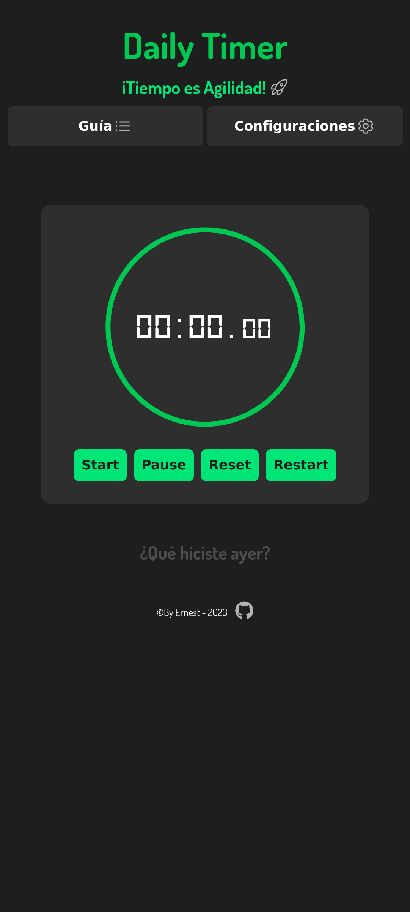
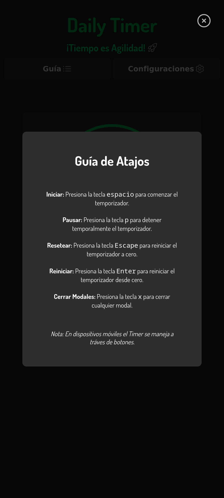
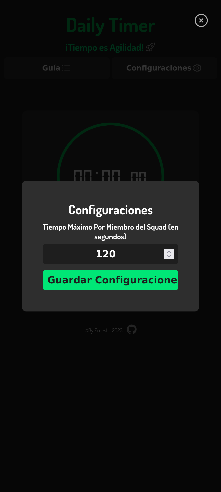
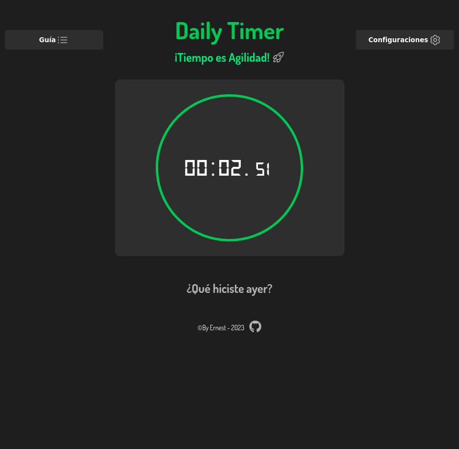
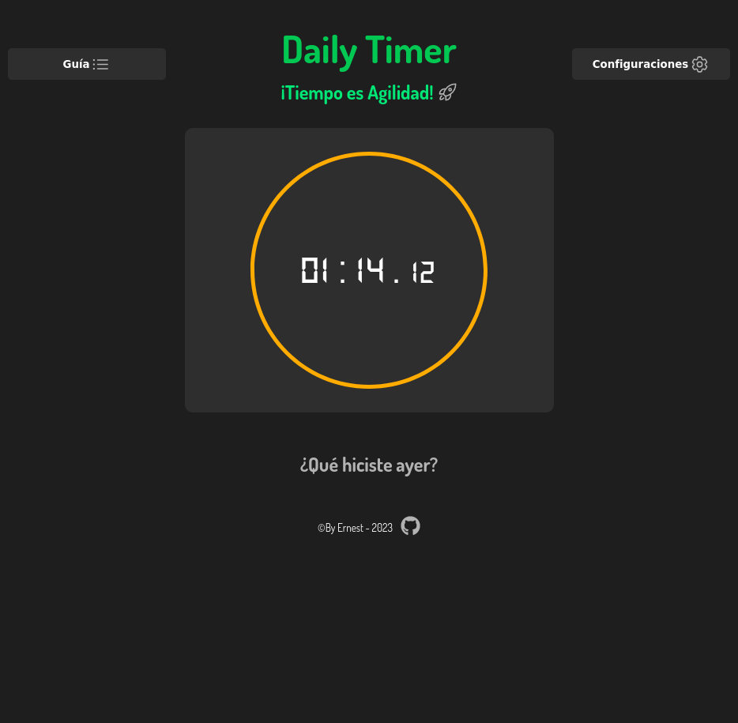
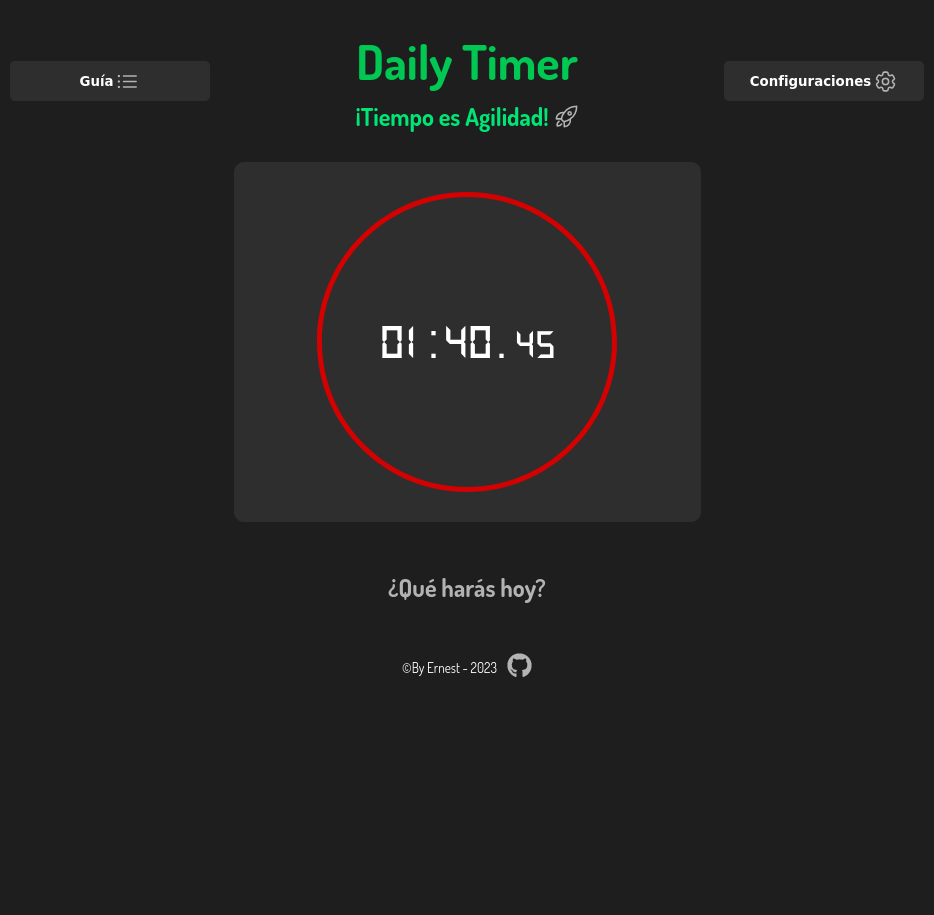

# Proyecto de Gestión de Tiempo para Daily Meetings

## Descripción
La aplicación de Gestión de Tiempo se trata de un Timer o Cronómetro que está diseñada específicamente para Scrum Masters y su equipo. Esta herramienta permite a los usuarios llevar un registro del tiempo transcurrido y establecer límites de tiempo para las diferentes actividades y eventos relacionados con su proyecto ágil.

Los Scrum Masters y equipos ágiles pueden beneficiarse de esta aplicación para:

- Establecer límites de tiempo para las reuniones diarias de scrum (Daily Scrum), eventos de planificación y retrospectivas.
- Visualizar alertas visuales cuando se alcancen los límites de tiempo predefinidos, lo que ayuda a mantener las reuniones y actividades dentro de los límites de tiempo planificados.
- Registrar el tiempo transcurrido en formato de minutos y segundos, lo que facilita la revisión y mejora continua.

Esta aplicación es una herramienta valiosa para aquellos que desean optimizar la gestión del tiempo en proyectos ágiles y garantizar una ejecución eficiente de los eventos y actividades planificados.

## Capturas de Pantalla

Nota: Tiempo mayor al Límite resultará en un efecto de parpadeo en el borde del cronómetro

## Características Principales
- Cronómetro y temporizador integrados.
- Configuración de límites de tiempo para tareas.
- Alertas visuales cuando se alcanzan los límites de tiempo.
- Registro del tiempo transcurrido en formato de minutos y segundos.

## Requisitos Previos
- Un navegador web moderno como Google Chrome o Mozilla Firefox.

## Uso
1. Abre la aplicación en tu navegador https://scrumtimer.netlify.app/ 
2. Iniciar: Presiona la tecla espacio para comenzar el temporizador.
3. Pausar: Presiona la tecla p para detener temporalmente el temporizador.
4. Resetear: Presiona la tecla Escape para reiniciar el temporizador a cero.
5. Reiniciar: Presiona la tecla Enter para reiniciar el temporizador desde cero.
6. Cerrar Modales: Presiona la tecla x para cerrar cualquier modal.

Nota: En dispositivos móviles el Timer se maneja a tráves de botones.

## Contribución
Si deseas contribuir a este proyecto, sigue estos pasos:
1. Haz un fork del repositorio.
2. Clona tu fork en tu máquina local.
3. Crea una nueva rama para tu contribución: `git checkout -b mi-contribucion`
4. Realiza tus cambios y commitea: `git commit -m "Agrega mi contribución"`
5. Haz un push a tu rama: `git push origin mi-contribucion`
6. Crea una solicitud de extracción (Pull Request) en GitHub.

## Licencia
Este proyecto está bajo la licencia MIT.

## Autor
- [Ernesto Daniel López Deggeller]
- Contacto: [ernestodaniellopez504@gmail.com]

## Agradecimientos
Queremos agradecer a todos los miembros del equipo que contribuyeron a este proyecto y a la comunidad de desarrolladores por su apoyo.

---

¡Disfruta de la Gestión de Tiempo!
